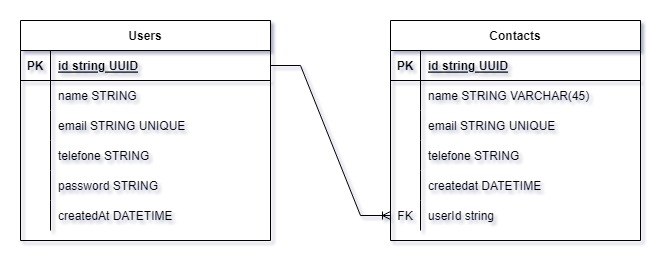

# DOCUMENTAÇÃO DA API

## Tabela de conteúdos

- [Visão Geral](#1-visão-geral)
- [Diagrama ER](#2-diagrama-er)
- [Para iniciar o projeto e utilizar a aplicação](#3-para-iniciar-o-projeto-e-utilizar-a-aplicação)
    - [Instalando Dependências](#31-instalando-dependências)
    - [Variáveis de Ambiente](#32-variáveis-de-ambiente)
    - [Migrations](#33-migrations)
- [Autenticação](#4-autenticação)
- [Endpoints](#5-endpoints)

---

## 1. Visão Geral

Visão de forma mais geral da aplicação, abaixo segue as tecnologias utilizadas para criação da mesma. A API foi criada com o intuito de um cliente conseguir
se cadastrar e também conseguir salvar os seus contatos associando ao mesmo. Contendo a possibilidade do usuário ter acesso aos usuários salvos, além de fazer
atualizações e deleções de um determinado contato.

- [NodeJS](https://nodejs.org/en/)
- [Express](https://expressjs.com/pt-br/)
- [TypeScript](https://www.typescriptlang.org/)
- [PostgreSQL](https://www.postgresql.org/)
- [TypeORM](https://typeorm.io/)
- [Yup](https://www.npmjs.com/package/yup)

URL BASE do projeto:
em construção...

---

## 2. Diagrama ER
[ Voltar para o topo ](#tabela-de-conteúdos)


Diagrama ER da API definindo bem as relações entre as tabelas do banco de dados.
O Usuário tem uma relação de 1:N com Contatos. Sendo assim, um usuário pode ter vários contatos e o contato só pode pertencer a um usuário.



---

## 3. Para iniciar o projeto e utilizar a aplicação
[ Voltar para o topo ](#tabela-de-conteúdos)


### 3.1. Instalando Dependências

Clone o projeto em sua máquina e instale as dependências com o comando:

```shell
yarn
```

### 3.2. Variáveis de Ambiente

Em seguida, crie um arquivo **.env**, copiando o formato do arquivo **.env.example**:
```
cp .env.example .env
```

Configure suas variáveis de ambiente com suas credenciais do Postgres e uma nova database da sua escolha.

### 3.3. Migrations

Execute as migrations com o comando:

```
yarn typeorm migration:run -d src/data-source.ts
```

---

## 4. Autenticação
[ Voltar para o topo ](#tabela-de-conteúdos)


Autenticação do projeto se deu através da utilização da tecnologia chamada Jsonwebtoken.

- [Jsonwebtoken](https://www.npmjs.com/package/jsonwebtoken)

---

## 5. Endpoints

[ Voltar para o topo ](#tabela-de-conteúdos)

### Índice

- [Users](#1-users)
    - [POST - /users](#11-criação-de-usuário)
    - [GET - /users](#12-listando-usuários)
	 - [GET - /users/:id](#13-listar-usuário-por-id)
    - [PATCH - /users/:id](#14-atualizar-usuário-por-id)
    - [DELETE - /users/:id](#15-deletar-usuário-por-id)
- [Login](#2-login)
    - [POST - /users](#21-login-de-usuário)
- [Contacts](#3-contacts)
    - [POST - /contacts](#31-criação-de-contato)
    - [GET - /contacts/user](#32-listando-contatos-de-usuário)
	 - [GET - /contacts/:id](#33-listar-contato-por-id)
    - [PATCH - /contacts/:id](#34-atualizar-contato-por-id)
    - [DELETE - /contacts/:id](#35-deletar-contato-por-id)
---

## 1. **Users**
[ Voltar para os Endpoints ](#5-endpoints)

O objeto User é definido como:

| Campo      | Tipo   | Descrição                                       |
| -----------|--------|-------------------------------------------------|
| id         | string | Identificador único do usuário                  |
| name       | string | O nome do usuário.                              |
| email      | string | O e-mail do usuário.                            |
| password   | string | A senha de acesso do usuário                    |
| telefone   | string | Telefone do usuário.                            |
| createdAt  | date   | Data de criação do usuári.                      |

### Endpoints

| Método   | Rota       | Descrição                               |
|----------|------------|-----------------------------------------|
| POST     | /users     | Criação de um usuário.                  |
| GET      | /users     | Lista todos os usuários                 |
| GET      | /users/:id     | Lista um usuário usando seu ID como parâmetro |
| PATCH    | /users/:id     | Atualiza um usuário usando seu ID como parâmetro |
| DELETE    | /users/:id     | Deleta um usuário usando seu ID como parâmetro |

---

### 1.1. **Criação de Usuário**

[ Voltar para os Endpoints ](#5-endpoints)

### `/users`

### Exemplo de Request:
```
POST /users
Host: 
Authorization: None
Content-type: application/json
```

### Corpo da Requisição:
```json
{
	"name": "Neto",
	"email": "neto@mail.com",
	"password": "1234",
	"telefone": "859984841"
}
```

### Schema de Validação com Yup:
```javascript
  name: yup.string().required(),
  email: yup.string().email().required(),
  telefone: yup.string().required(),
  password: yup.string().required(),
```
OBS.: Chaves não presentes no schema serão removidas.

### Exemplo de Response:
```
201 Created
```

```json
{
	"createdAt": "2023-03-27T04:15:37.449Z",
	"telefone": "859458416",
	"email": "neto3@mail.com",
	"name": "Neto",
	"id": "01e876bb-da11-4423-b1c4-c8742ef29d80"
}
```

### Possíveis Erros:
| Código do Erro | Descrição |
|----------------|-----------|
| 409 Conflict   | Email already registered. |
| 400 Bad Request | Todos os campos são requeridos. |

---

### 1.2. **Listando Usuários**

[ Voltar aos Endpoints ](#5-endpoints)

### `/users`

### Exemplo de Request:
```
GET /users
Host: 
Authorization: Bearer token
Content-type: application/json
```

### Corpo da Requisição:
```json
Vazio
```

### Exemplo de Response:
```
200 OK
```
```json
[
	{
		"createdAt": "2023-03-26T20:07:59.465Z",
		"telefone": "859458416",
		"email": "milfont@mail.com",
		"name": "Milfont",
		"id": "f21dcc11-d4ef-4f05-8868-6d3251dbda6c"
	}
]
```

### Possíveis Erros:
Obs: Pode acontecer de retornar uma lista vazia caso a aplicação não tenha nenhum usuário cadastrado!

| Código do Erro | Descrição |
|----------------|-----------|
| 401 Unauthorized | Token invalid. |

---

### 1.3. **Listar Usuário por ID**

[ Voltar aos Endpoints ](#5-endpoints)

### `/users/:id`

### Exemplo de Request:
```
GET /users/01e876bb-da11-4423-b1c4-c8742ef29d80
Host: 
Authorization: None
Content-type: application/json
```

### Parâmetros da Requisição:
| Parâmetro   | Tipo        | Descrição                             |
|-------------|-------------|---------------------------------------|
| id     | string      | Identificador único do usuário (User) |

### Corpo da Requisição:
```json
Vazio
```

### Exemplo de Response:
```
200 OK
```
```json
{
	"createdAt": "2023-03-26T00:05:21.537Z",
	"telefone": "859458416",
	"email": "neto@mail.com",
	"name": "Neto Milfont",
	"id": "18d3f78a-617c-4362-ac11-9effc592309e"
}
```

### Possíveis Erros:
| Código do Erro | Descrição |
|----------------|-----------|
| 404 Not Found   | User not found. |
| 403 Forbidden   | You don't have permition |
| 401 Unauthorized | Token invalid. |

---

### 1.4. **Atualizar Usuário por ID**

[ Voltar aos Endpoints ](#5-endpoints)

### `/users/:id`

### Exemplo de Request:
```
GET /users/01e876bb-da11-4423-b1c4-c8742ef29d80
Host: 
Authorization: None
Content-type: application/json
```

### Parâmetros da Requisição:
| Parâmetro   | Tipo        | Descrição                             |
|-------------|-------------|---------------------------------------|
| id     | string      | Identificador único do usuário (User) |

### Corpo da Requisição:
```json
  Você pode atualizar o nome, telefone, password e email.
```

### Exemplo de Response:
```
200 OK
```
```json
{
	"name": "Guilherme",
	"password": "12345"
}
```

### Possíveis Erros:
| Código do Erro | Descrição |
|----------------|-----------|
| 404 Not Found   | User not found. |
| 403 Forbidden   | You don't have permition |
| 401 Unauthorized | Token invalid. |

---

### 1.5. **Deletar Usuário por ID**

[ Voltar aos Endpoints ](#5-endpoints)

### `/users/:id`

### Exemplo de Request:
```
GET /users/01e876bb-da11-4423-b1c4-c8742ef29d80
Host: 
Authorization: None
Content-type: application/json
```

### Parâmetros da Requisição:
| Parâmetro   | Tipo        | Descrição                             |
|-------------|-------------|---------------------------------------|
| id     | string      | Identificador único do usuário (User) |

### Corpo da Requisição:
```json
  Vazio
```

### Exemplo de Response:
```
204 No Content
```
```json
Vazio
```

### Possíveis Erros:
| Código do Erro | Descrição |
|----------------|-----------|
| 404 Not Found   | User not found. |
| 403 Forbidden   | You don't have permition |
| 401 Unauthorized | Token invalid. |

---

## 2. **Login**
[ Voltar para os Endpoints ](#5-endpoints)

### Endpoints

| Método   | Rota       | Descrição                               |
|----------|------------|-----------------------------------------|
| POST     | /login     | Login de um usuário.                  |

---

### 2.1. **Login de usuário**

[ Voltar para os Endpoints ](#5-endpoints)

### `/login`

### Exemplo de Request:
```
POST /login
Host: 
Authorization: None
Content-type: application/json
```

### Corpo da Requisição:
```json
{
	"email": "neto@mail.com",
	"password": "12345"
}
```
### Exemplo de Response:
```
200 Ok
```

```json
{
	"token": "eyJhbGciOiJIUzI1NiIsInR5cCI6IkpXVCJ9.eyJpYXQiOjE2Nzk4NzAyMzQsImV4cCI6MTY3OTk1NjYzNCwic3ViIjoiMThkM2Y3OGEtNjE3Yy00MzYyL
   WFjMTEtOWVmZmM1OTIzMDllIn0.jVL3_DPPX2OS_08kBR5rReu45XCux0hk1Z4lsNGXS_I"
}
```

### Possíveis Erros:
| Código do Erro | Descrição |
|----------------|-----------|
| 401 Unauthorized   | Invalid user or password! |

---

## 3. **Contacts**
[ Voltar para os Endpoints ](#5-endpoints)

O objeto Contact é definido como:

| Campo      | Tipo   | Descrição                                       |
| -----------|--------|-------------------------------------------------|
| id         | string | Identificador único do contato.                  |
| name       | string | O nome do contato.                              |
| email      | string | O e-mail do contato.                            |
| telefone   | string | Telefone do contato.                            |
| createdAt  | date   | Data de criação do contato.                     |
| userId     | User   | Id do usuário responsável pela criação do contato. |

### Endpoints

| Método   | Rota       | Descrição                               |
|----------|------------|-----------------------------------------|
| POST     | /contacts     | Criação de um contato.                  |
| GET      | /contacts/user     | Lista todos os contatos de um usuário.  |
| GET      | /contacts/:id     | Lista um contato usando seu ID como parâmetro |
| PATCH    | /contacts/:id     | Atualiza um contato usando seu ID como parâmetro |
| DELETE    | /contacts/:id     | Deleta um contato usando seu ID como parâmetro |

---

### 3.1. **Criação de Contato**

[ Voltar para os Endpoints ](#5-endpoints)

### `/contacts`

### Exemplo de Request:
```
POST /contacts
Host: 
Authorization: Bearer token
Content-type: application/json
```

### Corpo da Requisição:
```json
{
	"name": "teteuzinho",
	"email": "teteuzinho@mail.com",
	"telefone": "859222222"
}
```

### Schema de Validação com Yup:
```javascript
  name: yup.string().required(),
  email: yup.string().email().required(),
  telefone: yup.string().required(),
```
OBS.: Chaves não presentes no schema serão removidas.

### Exemplo de Response:
```
201 Created
```

```json
{
	"createdAt": "2023-03-27T02:55:11.088Z",
	"telefone": "859222222",
	"email": "teteuzinho@mail.com",
	"name": "teteuzinho",
	"id": "28129ea4-2026-4733-bdf1-2a6a984cd656"
}
```

### Possíveis Erros:
| Código do Erro | Descrição |
|----------------|-----------|
| 401 Unauthorized | Token invalid. |

---

### 3.2. **Listando Contatos de Usuário**

[ Voltar aos Endpoints ](#5-endpoints)

### `/contacts/user`

### Exemplo de Request:
```
GET /contacts
Host: 
Authorization: Bearer token
Content-type: application/json
```

### Corpo da Requisição:
```json
Vazio
```

### Exemplo de Response:
```
200 OK
```
```json
[
	{
		"id": "abd039b3-e6cf-464a-8e95-34e4cca2f494",
		"name": "teteuz",
		"email": "teteuz@mail.com",
		"telefone": "859222222",
		"createdAt": "2023-03-26T22:41:43.747Z"
	},
	{
		"id": "a620e03c-d7d8-4d7e-b9dc-cbdeaffd5c0d",
		"name": "netinholindASoooo",
		"email": "tetoid@mail.com",
		"telefone": "859222222",
		"createdAt": "2023-03-27T02:47:24.170Z"
	}
]
```

### Possíveis Erros:
Obs: Pode acontecer de retornar uma lista vazia caso o usuário não possua nenhum contato cadastrado!

| Código do Erro | Descrição |
|----------------|-----------|
| 401 Unauthorized | Token invalid. |

---

### 3.3. **Listar Contato por ID**

[ Voltar aos Endpoints ](#5-endpoints)

### `/contacts/:id`

### Exemplo de Request:
```
GET /contacts/a620e03c-d7d8-4d7e-b9dc-cbdeaffd5c0d
Host: 
Authorization: Bearer token
Content-type: application/json
```

### Parâmetros da Requisição:
| Parâmetro   | Tipo        | Descrição                             |
|-------------|-------------|---------------------------------------|
| id     | string      | Identificador único do contato (Contact) |

### Corpo da Requisição:
```json
Vazio
```

### Exemplo de Response:
```
200 OK
```
```json
{
	"createdAt": "2023-03-27T02:47:24.170Z",
	"telefone": "859222222",
	"email": "tetoid@mail.com",
	"name": "netão",
	"id": "a620e03c-d7d8-4d7e-b9dc-cbdeaffd5c0d"
}
```

### Possíveis Erros:
| Código do Erro | Descrição |
|----------------|-----------|
| 403 Forbidden   | You don't have permition |
| 401 Unauthorized | Token invalid. |

---

### 3.4. **Atualizar Contato por ID**

[ Voltar aos Endpoints ](#5-endpoints)

### `/contacts/:id`

### Exemplo de Request:
```
GET /contacts/a620e03c-d7d8-4d7e-b9dc-cbdeaffd5c0d
Host: 
Authorization: Bearer token
Content-type: application/json
```

### Parâmetros da Requisição:
| Parâmetro   | Tipo        | Descrição                             |
|-------------|-------------|---------------------------------------|
| id     | string      | Identificador único do contato (Contact) |

### Corpo da Requisição:
```json
  Você pode atualizar o nome, telefone e email.
{
	"name": "netinho"
}
```

### Exemplo de Response:
```
200 OK
```
```json
{
	"createdAt": "2023-03-27T02:47:24.170Z",
	"telefone": "859222222",
	"email": "tetoid@mail.com",
	"name": "netinholindASoooo",
	"id": "a620e03c-d7d8-4d7e-b9dc-cbdeaffd5c0d"
}
```

### Possíveis Erros:
| Código do Erro | Descrição |
|----------------|-----------|
| 404 Not Found   | User not found. |
| 403 Forbidden   | You don't have permition |
| 401 Unauthorized | Token invalid. |

---

### 3.5. **Deletar Contato por ID**

[ Voltar aos Endpoints ](#5-endpoints)

### `/contacts/:id`

### Exemplo de Request:
```
GET /contacts/07e24ba7-014c-4996-9e97-d48c889edd85
Host: 
Authorization: Bearer token
Content-type: application/json
```

### Parâmetros da Requisição:
| Parâmetro   | Tipo        | Descrição                             |
|-------------|-------------|---------------------------------------|
| id     | string      | Identificador único do contato. (Contact) |

### Corpo da Requisição:
```json
  Vazio
```

### Exemplo de Response:
```
204 No Content
```
```json
Vazio
```

### Possíveis Erros:
| Código do Erro | Descrição |
|----------------|-----------|
| 404 Not Found   | Contato not found. |
| 403 Forbidden   | You don't have permition |
| 401 Unauthorized | Token invalid. |

---
